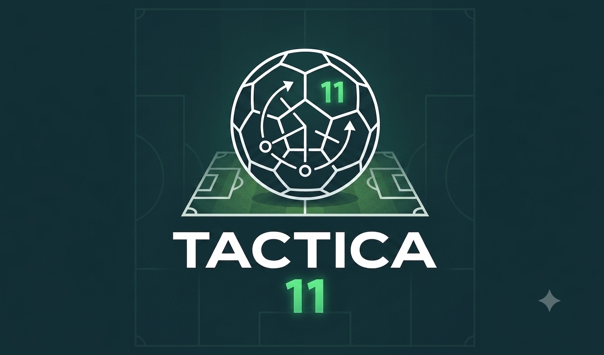
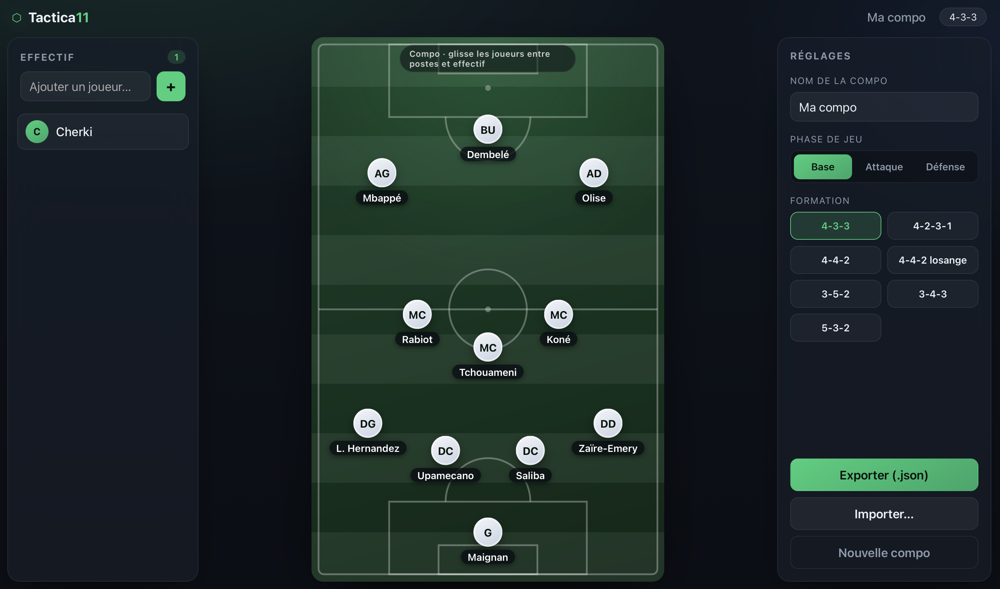

# Tactica11




App web pour créer des **compos et mises en place tactiques de football** :
choix de la formation, placement libre des joueurs, variantes **attaque / défense**,
vivier de joueurs en glisser-déposer, le tout sauvegardable en fichier `.json`.

100 % côté navigateur — **aucun backend**, aucune synchro en ligne. Utilisable sur
iPad et ordinateur, installable comme une app (PWA).

## Capture d'écran



## Lancer en développement

```bash
npm install      # une seule fois
npm run dev      # serveur local → http://localhost:5173
```

## Construire la version finale

```bash
npm run build    # génère le dossier dist/ (à héberger n'importe où)
npm run preview  # prévisualiser le build
```

## Stack

- **React + TypeScript** (Vite)
- **Framer Motion** pour les animations (positionnement libre au ressort,
  transitions attaque ↔ défense, bascule de formation)
- Stockage local (`localStorage`) + **export / import `.json`**

## Modèle de données

Une compo = un nom, une formation, une liste de joueurs et 11 emplacements.
Chaque emplacement garde **deux jeux de positions** (attaque et défense) que l'on
peut ajuster librement. Voir `src/types.ts` et `src/formations.ts`.
