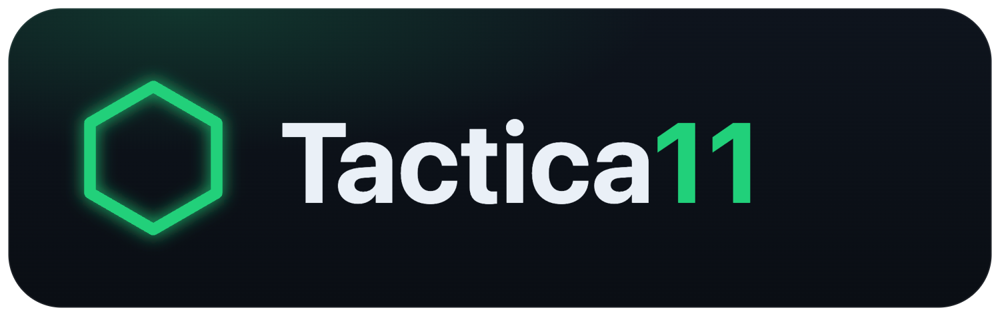

# Tactica11



App web pour créer des **compos et mises en place tactiques de football** :
formation, placement libre des joueurs, variantes par **phase de jeu**
(base / attaque / défense), zones d'influence, calque de dessin, adversaires,
le tout partageable par lien ou exportable.

100 % côté navigateur — **aucun backend**, aucune synchro en ligne. Utilisable sur
iPad et ordinateur, installable comme une app (PWA).

## 🔗 En ligne

👉 **[florentfougeres.github.io/Tactica11](https://florentfougeres.github.io/Tactica11/)**

(Déployée automatiquement sur GitHub Pages à chaque `push` sur `main`.)

## Capture d'écran


## Fonctionnalités

- **Formations** prêtes à l'emploi : 4-3-3 (et faux 9), 4-2-3-1, 4-4-2,
  4-4-2 losange, 3-5-2, 3-4-3, 3-4-2-1, 4-5-1, 5-3-2, 5-2-3, 5-4-1.
- **Phases de jeu** : base, **attaque** et **défense**, chaque emplacement
  gardant ses propres positions par phase + un **slider** pour scruber la
  transition défense ↔ attaque.
- **Placement libre** des joueurs sur le terrain, animé au ressort (Framer Motion).
- **Effectif en glisser-déposer** : vivier de joueurs, titulaires + remplaçants
  par poste, numéros de maillot optionnels.
- **Zones d'influence** par joueur ou par équipe, avec presets de rôles
  (type EA FC) ajustables à la main.
- **Calque de dessin** par phase : flèches (courses), flèches pointillées
  (passes), tracé à main levée et zones.
- **Adversaires** : place les 11 disques adverses en attaque/défense, avec
  sélecteur de couleur.
- **Grille positionnelle** en surimpression.
- **Mode présentation plein écran** avec tiroir d'outils repliable.
- **Orientation** portrait / paysage du terrain.
- **Annuler / rétablir** (boutons + `⌘/Ctrl + Z`, `⇧` pour rétablir).
- **Plusieurs compos** sauvegardées en local (`localStorage`).
- **Partage & export** : lien partageable (URL compressée), export / import
  `.json`, export du terrain en **image PNG**, import de joueurs depuis un
  fichier **CSV**.
- **PWA** installable, utilisable hors-ligne.

## Lancer en développement

```bash
npm install      # une seule fois
npm run dev      # serveur local → http://localhost:5173
```

## Construire la version finale

```bash
npm run build    # génère le dossier dist/ (à héberger n'importe où)
npm run preview  # prévisualiser le build
npm run lint     # oxlint
```

> ⚠️ Le build utilise `base: '/Tactica11/'` (pour GitHub Pages). En dev et en
> `preview`, la base reste `/` — voir `vite.config.ts`.

## Stack

- **React 19 + TypeScript** (Vite)
- **Framer Motion** pour les animations (positionnement libre au ressort,
  transitions attaque ↔ défense, bascule de formation)
- **lz-string** (liens partageables compressés), **html-to-image** (export PNG),
  **papaparse** (import CSV)
- **vite-plugin-pwa** (mode hors-ligne / installation)
- Stockage local (`localStorage`) + **export / import `.json`**

## Modèle de données

Une compo = un nom, une formation, une liste de joueurs et 11 emplacements.
Chaque emplacement garde **un jeu de positions par phase** (base, attaque,
défense) et une zone d'influence optionnelle, que l'on peut ajuster librement.
S'y ajoutent les adversaires, les dessins par phase et la couleur adverse.
Voir `src/types.ts` et `src/formations.ts`.
